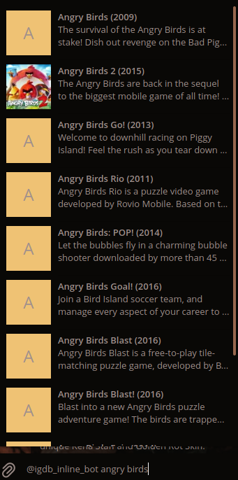
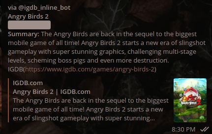

# Telegam IGDB Inline Bot

This is a bot developed in java as a help to query and get direct access to IGDB page. It was made just as a POC based
on Micronaut, Webhooks and GitHub Packages deployed in a Kubernetes node

## Libs

- Handlebars
- TelegramBots
- IGDB-API-JVM

## How to Use

A Telegram account is needed and you can call the Webhook by typing `igdb_inline_bot` in any chat.


After selecting the desired game it will be written in the conversation.


The output inludes the title of the game, the Rating as spoiler, a summary and TGDB link.

## How to deploy

- The bot is deployed ina minikube cluster. For that start and get the ip to forward request with ngrok
````shell
minukube start
````
````shell
minikube service list
````
- The bot uses Ngrok to route API calls from Telegram. But theres no contraint to use a different vendor or routing technology. The bot is deployed locally using the port `8080`. so the first step is to run ngrok using this command:
```shell
./ngrok http <<minikubeip>>:8080
```
- This will provide the forwarding URL (in HTTPs) to provide to the bot

- this bot has a docker image and can be deployed in a Kubernetes environment. In this case, all artifacts can be created n order
````shell
kubectl create -f cm-igdb-telegram-inline-bot.yaml 
kubectl create -f service.yaml 
kubectl create -f deployment.yaml 
````
